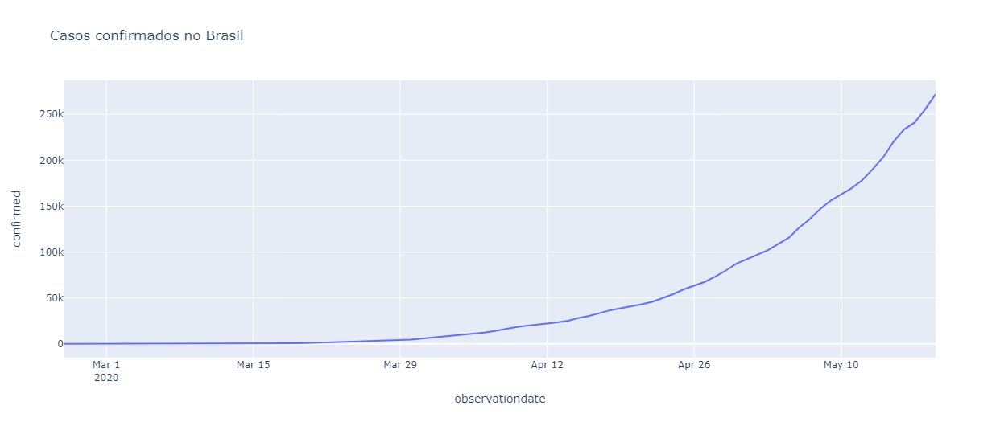
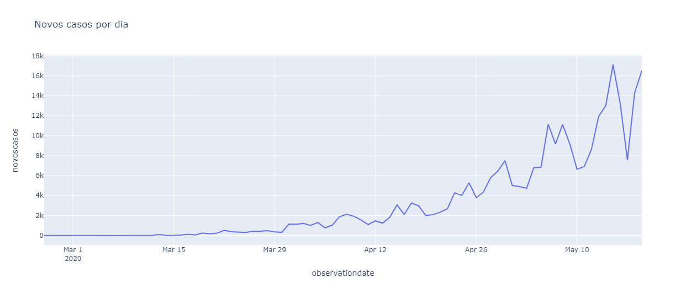
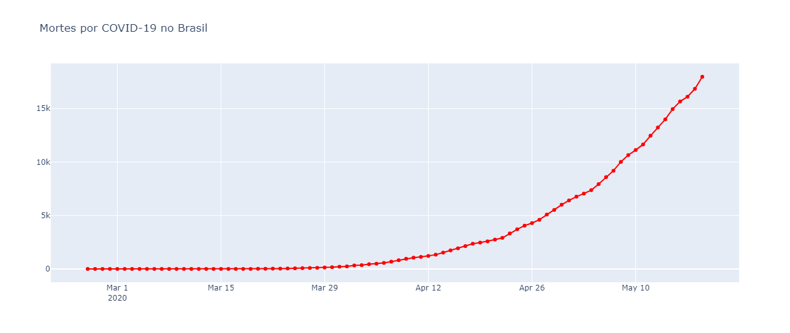
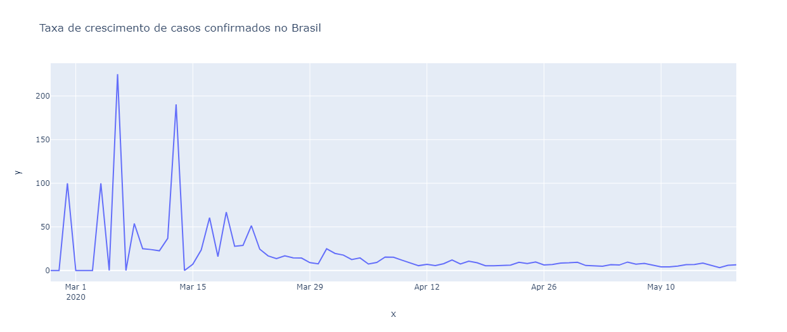
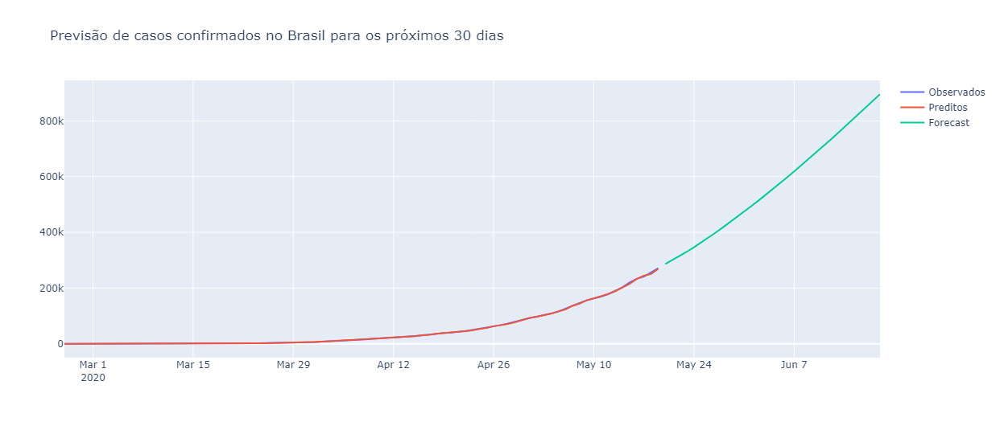
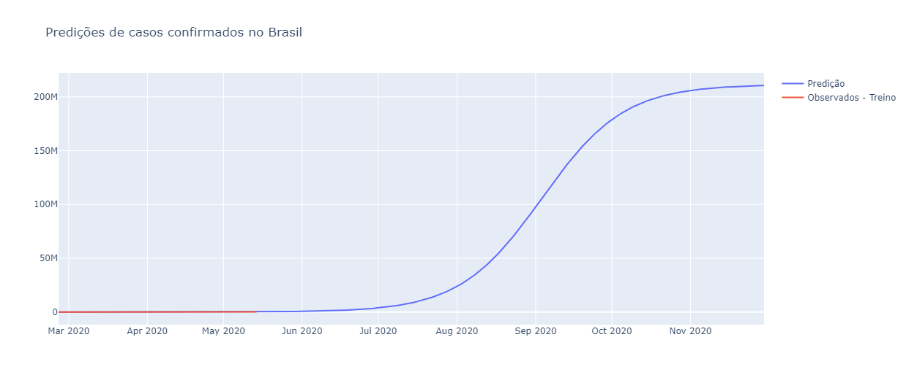

# 📈 Modelos de Previsão da Evolução do COVID-19 no Brasil

Este projeto utiliza **Python** e **Machine Learning** para criar modelos que preveem a evolução do COVID-19 no Brasil, baseando-se em dados históricos. O objetivo é fornecer insights sobre a propagação e o impacto do vírus ao longo do tempo.

## 🛠️ Tecnologias Utilizadas

- **`pandas`**: Manipulação e análise de dados
- **`numpy`**: Operações numéricas e matriciais
- **`datetime`**: Manipulação de datas
- **`plotly`**: Criação de gráficos interativos
- **`statsmodels`**: Análise estatística e decomposição temporal
- **`matplotlib`**: Visualizações de dados
- **`pmdarima`**: Modelagem de séries temporais ARIMA
- **`prophet`**: Previsão de séries temporais

## ⚙️ Funcionalidades

- Coleta e análise de dados históricos de casos de COVID-19 no Brasil
- Treinamento de modelos preditivos utilizando algoritmos de Machine Learning
- Visualização gráfica das previsões

## 📊 Modelos Utilizados

Foram empregados modelos de séries temporais para prever a evolução dos casos de COVID-19 no Brasil, com foco em dois algoritmos principais:

- **`ARIMA`**: Um modelo estatístico amplamente utilizado para previsão de séries temporais, eficiente para capturar padrões de tendência e sazonalidade nos dados.
- **`Prophet`**: Modelo criado pelo Facebook, conhecido por sua capacidade de lidar com sazonalidade e irregularidades, como feriados e eventos excepcionais.

## 📥 Fonte de Dados

Os dados de COVID-19 utilizados neste projeto foram obtidos do seguinte repositório: [COVID-19 Data](https://github.com/neylsoncrepalde/projeto_eda_covid/blob/master/covid_19_data.csv?raw=true).

Esses dados incluem o número de casos confirmados e óbitos diários, além de outras informações relevantes para o treinamento dos modelos preditivos.

## 📈 Resultados da Análise

A seguir estão os resultados visuais obtidos a partir da análise dos dados de COVID-19. Estes gráficos ajudam a compreender a evolução da pandemia e as previsões para o futuro.

### 📌 Casos confirmados no Brasil
Este gráfico mostra a evolução dos casos confirmados de COVID-19 no Brasil ao longo do tempo.

### 📌 Novos casos por dia
Visualiza a quantidade de novos casos diários de COVID-19, destacando as variações diárias.

### 📌 Mortes por COVID-19 no Brasil
Mostra o número total de mortes registradas no Brasil ao longo do período de análise.

### 📌 Taxa de crescimento de casos confirmados no Brasil
Ilustra a taxa de crescimento diário dos casos confirmados de COVID-19, oferecendo uma visão sobre a aceleração ou desaceleração da pandemia.

### 📌 Previsão de casos confirmados no Brasil para os próximos 30 dias
Projeção dos casos confirmados de COVID-19 no Brasil para os próximos 30 dias, utilizando modelos preditivos de séries temporais.

### 📌 Predições de casos confirmados no Brasil
Predições dos casos confirmados com base em diferentes abordagens de Machine Learning.

## 📝 Conclusão

Este projeto foi desenvolvido com intuito educacional, para explorar o uso de ferramentas de Machine Learning e análise de séries temporais. As previsões geradas são exemplos práticos da aplicação dos modelos, mas não devem ser interpretadas como previsões reais ou base para decisões de políticas públicas. O foco principal é o aprendizado e a aplicação das bibliotecas e técnicas discutidas.